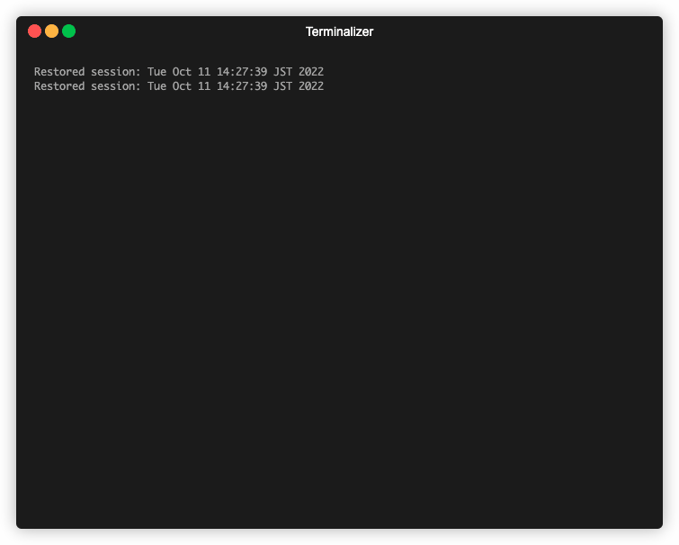

# Simple file storage server with a CLI interface

## Overview

A simple file storage server securely helps manage files to servers.

### Demo



### Feaatures

#### Functional features

1. Upload a file: POST /files/<name>, Content-Type: multipart/form-data
2. Delete a file: DELETE /files/<fileid>
3. List uploaded files (if a file is uploaded then deleted it should not be listed): GET
   /files returns a list of files: [{id:”...”, name: “file1.txt”}, {id:”...”, name:”file2.txt”}]
4. Download a file by id: GET /files/<fileid>

#### Nonfunctional features

- Files are protected with encryption
- Supports CLI help
- Supports file encoding

---

### Build production

#### Prepare environment variable

```bash
$ cp .env.example .env.production
```

> update environement variable

#### Build docker image

```bash
$ docker-compose up -d --build simple-storage --remove-orphans
```

### How it works

#### CLI help

```bash
$ docker run -it simplestorage-simple-storage cli -h
```

##### CLI output

```
cli [command]

Commands:
  cli delete <fileid>    Delete a file
  cli download <fileid>  Download a file
  cli list               Lists files
  cli upload <path>      Upload a file

Options:
      --version  Show version number                                   [boolean]
  -h, --help     Show help                                             [boolean]
```

#### Upload a file

```bash
$ docker run -it -v $(pwd)/data:/data -v $(pwd)/files:/app/files simplestorage-simple-storage cli upload /data/upload-test.txt
```

#### Download a file

```bash
$ docker run -it -v $(pwd)/data:/data -v $(pwd)/files:/app/files simplestorage-simple-storage cli download 801c360d-6d9b-4c29-ac89-47488a6cef61 --out /data

```

#### List uploaded files

```bash
$ docker run -it -v $(pwd)/files:/app/files simplestorage-simple-storage cli list

```

#### Delete a file

```bash
$ docker run -it -v $(pwd)/files:/app/files simplestorage-simple-storage cli delete f4919957-fefc-4259-95b6-abd3498b47f9

```

---

## Setup development

```bash
$ cp .env.example .env.development
$ nvm use
$ npm i
```

### Run CLI in a development environment

```bash
$ npx ts-node src/cli.ts -h
```

#### output

```
cli.ts [command]
Commands:
  cli.ts delete <fileid>    Delete a file
  cli.ts download <fileid>  Download a file
  cli.ts list               Lists files
  cli.ts upload <path>      Upload a file
```

#### Upload a file

```bash
$ npx ts-node src/cli.ts upload ./package.json
```

> uploaded files are encrypted

#### Download a file

```bash
$ npx ts-node src/cli.ts --out ./db download 318dd246-bc99-4e0b-acf0-7d97c53f1c40
```

> downloaded files are decryped and downloaded into output directory

#### Delete a file

```bash
$ npx ts-node src/cli.ts delete f887ad29-441f-4f3a-a290-20d1f5a39914
```

> delete file with fileid

#### List files

```bash
$ npx ts-node src/cli.ts list
```

> list all files

## Dev Tutorial

### Create a source directory

```bash
$ mkdir simplestorage
$ cd simplestorage
```

### Check node version

```bash
$ node -v
```

> v16.17.1

### Set node version

```bash
$ echo $(node -v) > .nvmrc
```

### use node version

```bash
$ nvm use
```

### setup node project

```bash
$ npm init -y
```

### setup node gitignore

```bash
$ curl -L -s https://www.gitignore.io/api/node > .gitignore
```

### setup typescript

```bash
$ npm install typescript --save-dev
$ npm install @types/node --save-dev
$ npx tsc --init --rootDir src --outDir dist \
--esModuleInterop --resolveJsonModule --lib es6 \
--module commonjs --allowJs true --noImplicitAny true
```

### setup source

```bash
$ mkdir src
$ touch src/index.ts
```

### setup dev env

```bash
$ npm install --save-dev ts-node nodemon
```

#### configure nodemon

```
{
  "watch": ["src"],
  "ext": ".ts",
  "ignore": [],
  "exec": "ts-node ./src/index.ts"
}
```

#### configure script

add following

```
"scripts": {
  "start:dev": "nodemon",
},
```

#### test configuration

```bash
$ npm run start:dev
```

### setup vscode

```bash
$ mkdir .vscode
$ touch .vscode/settings.json
```

#### configure vscode

```
{
  "eslint.enable": true,
  "[typescript]": {
    "editor.formatOnSave": true
  },
  "javascript.validate.enable": false,
  "files.exclude": {
    "**/.git": true,
    "**/.DS_Store": true,
    "node_modules/": true,
    "dist/": true,
    "npm": true
  }
}
```

### setup code lint

```bash
$ npm install --save-dev prettier tslint tslint-config-prettier tslint-plugin-prettier
```

#### configure Typescript Lint

add the following to tslint.json

```
{
  "rulesDirectory": ["tslint-plugin-prettier"],
  "rules": {
    "prettier": true
  }
}
```

#### configure code formatting

add the following to .prettierrc

```
{
  "semi": true,
  "trailingComma": "es5",
  "singleQuote": true,
  "printWidth": 80,
  "tabWidth": 2,
  "bracketSpacing": true,
  "arrowParens": "always"
}
```

### setup test

```bash
$ npm install --save-dev jest ts-jest @types/jest
$ mkdir tests
$ tests/index.test.ts
```

#### configure jest

```bash
$ npx ts-jest config:init
```

> make necessary changes in jest.config.js

#### add test script

```
"scripts": {
  "test": "jest"
},
```

#### create and test greet

```bash
$ touch src/greet.ts
$ test/greet.test.ts
```

#### test the configuration

```bash
$ npm test

```

### setup env

```bash
$ npm install --save-dev dotenv-cli
```

#### update script

```
"scripts": {
  "start:dev": "dotenv -e .env -- nodemon",
},
```

### setup docker dev

#### Create docker-compose.yml

```
version: '3'
services:
  dev-simple-storage:
    container_name: dev-simple-storage
    build:
      context: .
      dockerfile: Dockerfile
    tty: true
    env_file: .env
    volumes:
      - ./jest.config.js:/app/jest.config.js
      - ./nodemon.json:/app/nodemon.json
      - ./tsconfig.json:/app/tsconfig.json
      - ./tslint.json:/app/tslint.json
      - ./src:/app/src
      - ./tests:/app/tests
    command: npm run start:dev

```

#### Create Dockerfile

```
FROM node:18-alpine3.15

WORKDIR /app

COPY package*.json ./

RUN npm install
```

#### how to run docker in a dev environment

##### build and run image

```bash
$ docker-compose up -d --build --remove-orphans
```

#### Logs of running dev container

Jump into the container shell

```bash
$ docker-compose exec dev-simple-storage sh
```

#### Other helpful docker commands

##### List all images

```bash
$ docker image ls

```

##### Remove all images at once

```bash
$ docker rmi $(docker images -q)
```

##### List all active containers

```bash
$ docker ps
```

##### List all active and dead containers

```bash
$ docker ps -a
```

##### Stop all running containers

```bash
$docker stop $(docker ps -a -q)
```

##### Delete all stopped containers:

```bash
$ docker rm $(docker ps -a -q)
```

### Setup command line

```bash
$ npm install yargs
$ npm install @types/yargs --save-dev
```

#### How to use

```bash
$ npx ts-node src/cli.ts -h
```

### Add CLI progress animation lib

```bash
$ npm install cli-progress --save
$ npm i --save-dev @types/cli-progress
```
